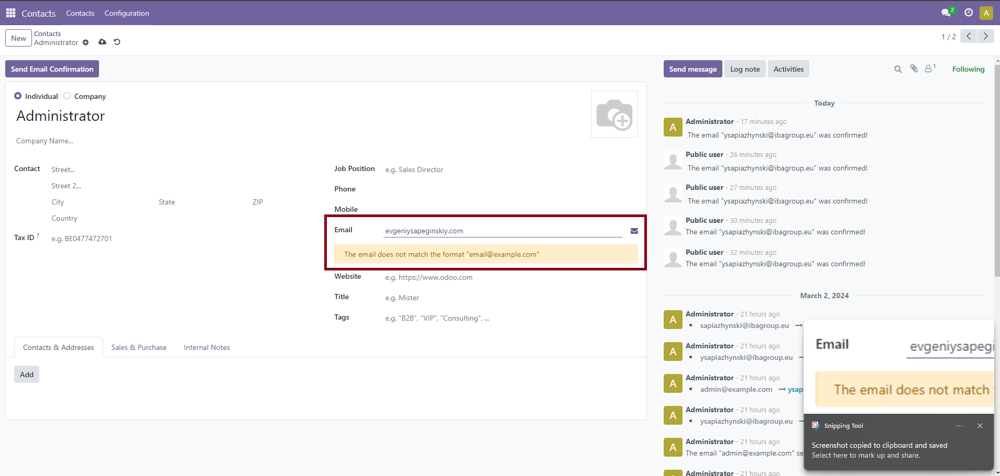
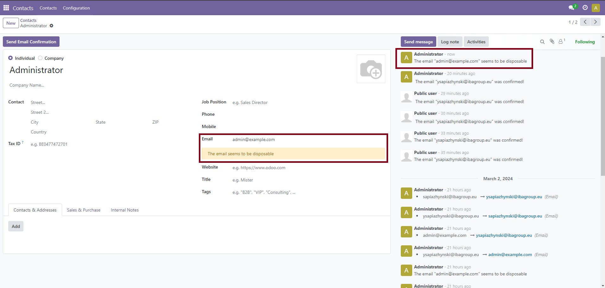
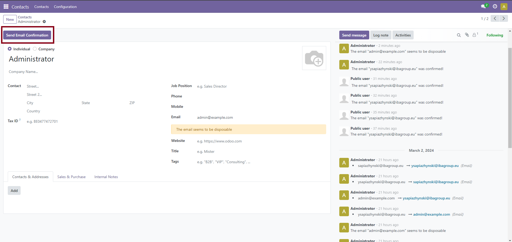
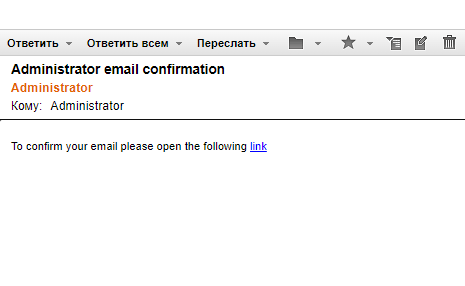
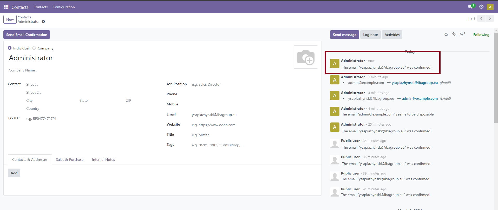
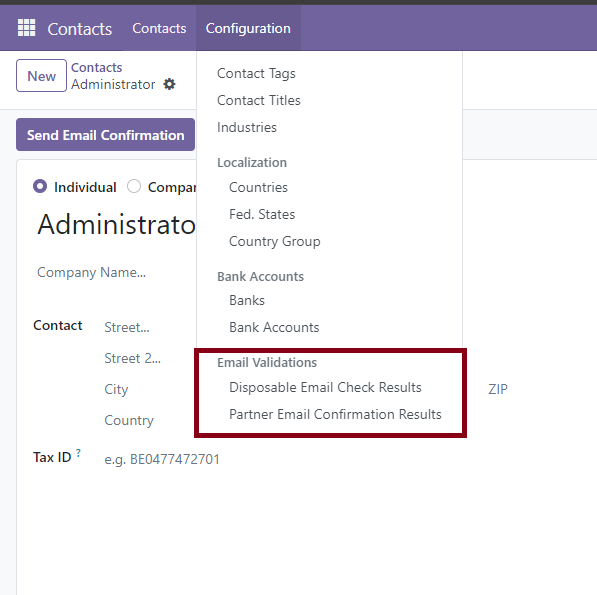
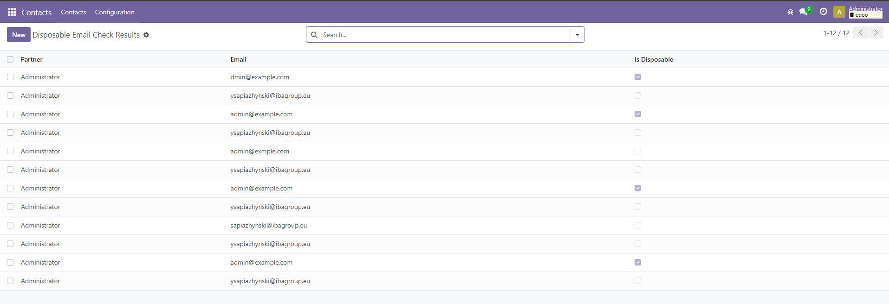
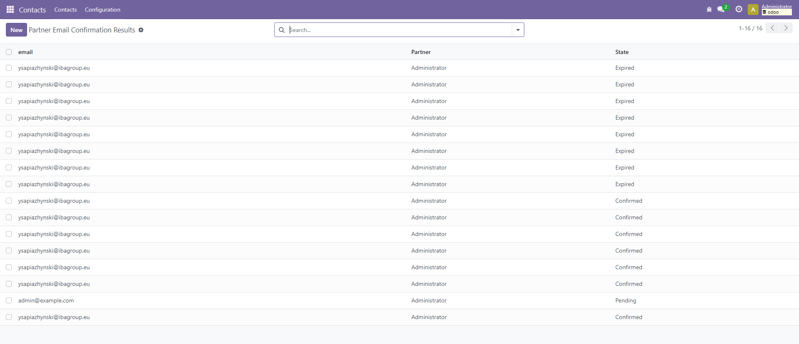

# 3 Steps validation of partner's email

- On change email format validation
    
- On save email check if it is disposable
    
- On send email confirmation
    
    
    
- For users with debug mode on
    
    
    